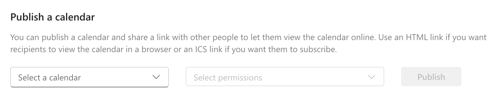

# Instruction to KevinZonda :: MyImperial

KevinZonda :: MyImperial is a utility aims to help Imperial College London DoC students access their education system. This platform is not affiliated to Imperial College London.

## Calendar

Calendar system use ics file to access the calendar.

To access your Imperial's calendar you should:
1. Go to [Outlook](https://outlook.office.com/mail/). Click the right top corner's setting button (looks like ⚙️)
2. Navigate to `Calendar -> Shared calendars -> Publish a calendar`
   
3. Choose the calendar you want to work with, usually is the `Calendar`.
4. Select permission to `Can view titles and locations`.
5. Click `Publish`
6. Copy the ICS link (a link ends with `.ics`) and do further work.

Now, you got the ICS link, but due to Microsoft's CORS policy, it can only be fetched by several domains, which does not include KevinZonda :: MyImperial. You need to proxy the ICS link to remove CORS restriction.

Otherwise you can use [KevinZonda OCPxS (Outlook iCalendar Proxy Service)](https://ical.kevinzonda.com/). This service is designed to proxy Office365 Outlook iCS link to remove CORS restriction. No data will be stored on the server. You can get its source code at [GitHub](https://github.com/KevinZonda/MyImperial/tree/master/outlookICalProxy).

Please be aware, use OCPxS service, you will pass your ICS link and data to the server, even though it will not be stored. If you concern about this, you can refer to the [instruction](./OCPxS.md) to host your own OCPxS service.

To work MyImperial with OCPxS, you need to paste your ICS link to the Settings then enable the proxy switch and save The ICS link will automatically convert into OCPxS link.

## Module/Course

You may need setup Module in order to work with calendar filter.

> I personally recommand you only set Module with Level 3 courses.

Go to infosys, you should copy all course you want to add. It might look like `70000 Computer Science Introduction` (format with `moduleId moduleName`).

Then go to the same module in the Ed, its URL may look like `https://edstem.org/us/courses/67000/discussion/`, the part `67000` is `edId`

You then can combine into a string with format `moduleId | moduleName | edId` (e.g. `70000 | Computer Science Introduction | 67000`). If you do not have the `edId`, you can leave it empty, but do not ignore the last `|`, i.e., `moduleId | moduleName |`.

You can use `---` as separator to split modules into groups.

Your modules string may look like:

```
70000 | Computer Science Introduction | 67000
70090 | Computer Science Introduction | 61000
70080 | Computer Science Introduction | 60000
---
70100 | Computer Science Introduction | 69032
70100 | Computer Science Introduction |
72000 | Computer Science Introduction | 63230
70001 | Computer Science Introduction | 60000

```


